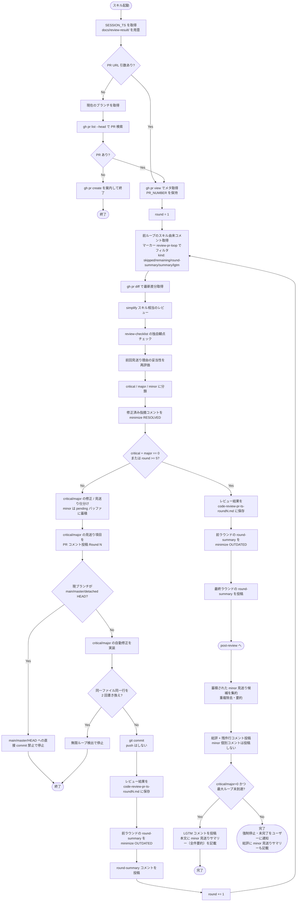
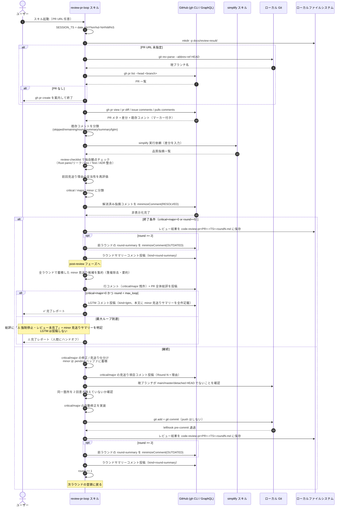

# review-pr-loop スキル フロー設計

自動コードレビュースキルの制御フローとシーケンスを図で示す設計書。

## 前提

| 項目 | 決定 |
| --- | --- |
| 起動入力 | PR URL（任意）。省略時は現在のブランチから自動検出 |
| PR 未検出時 | `gh pr create` を案内してスキル終了（レビューしない） |
| push の扱い | commit のみ自動、push は人間（lefthook で最終防衛） |
| レビュー実装 | simplify スキル + Grove 独自観点の上乗せ |
| レビュー観点 | コード品質 / テスト有無 / Doc コメント / セキュリティ / パフォーマンス / Rust デスクトップアプリ特有（panic, メモリリーク, unsafe, リソース解放） |
| 終了条件 | critical + major = 0、または最大 5 ループ到達 |
| ループ上限 | 5 回 |
| コメント形式 | critical/major は行コメント、総評は PR 全体コメント |
| minor 見送り時 | ループ中は一旦まとめて保留。全レビュー終了後、個別 PR コメント化はせず、最終 LGTM（または総評）コメント内の「🤔 見送った minor 指摘」セクションに全件の要約リストとして記載する |
| 見送り記録 | 見送り内容 + 理由 + ループ回数を PR コメントに残す |
| 見送り再評価 | 次ループで前回見送りコメントを読み込み、見送り判断自体を再レビュー |
| ループ番号可視化 | 全コメントに `[Round N/5]` を明記 |
| 対応完了コメント | GitHub GraphQL `minimizeComment(RESOLVED)` で非表示化 |
| 誤爆防止 | マーカー `<!-- review-pr-loop:round=N;kind=... -->` 付きコメントのみを操作対象にする |
| uuid 生成 | `uuidgen` コマンドで 1 コメントごとに新規発行（macOS/Linux 標準搭載） |
| セッション識別 | スキル起動時に `date +%Y%m%d-%H%M%S` で `SESSION_TS` を取得し全ラウンドで共通利用 |
| レビュー結果保存 | 各ラウンド終了時に `docs/review-result/code-review-pr<PR>-<SESSION_TS>-round<R>.md` に詳細ログを保存（`.gitignore` 対象、ローカル参照専用） |
| ラウンドサマリー | 各ラウンド終了時に PR に `kind=round-summary` コメントを投稿。次ラウンド開始時に前ラウンド分を `minimizeComment(OUTDATED)` で非表示化（削除せずトグル展開で閲覧可能） |
| LGTM 判定 | 正常終了（critical/major=0 かつ最大ループ未到達）なら `kind=lgtm` コメントを投稿。最大ループ到達時は LGTM 不投稿、総評に「強制停止・レビュー未完了」を明記 |

## フローチャート（全体制御）



## シーケンス図（1 ラウンド分の詳細）



## コメント本文テンプレート

### A. 見送り理由コメント（ループ途中）

```
<!-- review-pr-loop:round=N;kind=skipped;id=<uuid> -->
🤔 **[Round N/5] 自動修正を見送った指摘**

**指摘内容**: <要約>
**対象**: `path/to/file.rs:42-48`
**重大度**: critical / major / minor
**見送り理由**: <理由 — 例: 設計判断が必要 / 既存パターンと矛盾 / 修正範囲が大きい / post-review でユーザーが見送り選択>
**確認経路**:
  - critical/major: 機械的修正が困難と判断（ループ内で自動決定）
  - minor: 全レビュー終了後の post-review フェーズでユーザーが「見送る」を選択

次のループでこの見送り判断自体を再評価します。
```

### B. 残件の行コメント（終了時）

重大度に応じて先頭に 🔴（critical）/ 🟠（major）/ 🟡（minor）を付与する。

```
<!-- review-pr-loop:round=N;kind=remaining;id=<uuid> -->
🔴 / 🟠 / 🟡 **[Round N/5] 残存する指摘（重大度: critical/major/minor）**

<内容>
```

### C. 総評コメント（終了時）

アイキャッチとして各セクションに絵文字を付与し、PR 一覧から視認しやすくする。

```
<!-- review-pr-loop:round=N;kind=summary;id=<uuid>;session=<SESSION_TS> -->
# 🤖 review-pr-loop レビュー総評

**🏁 終了ステータス**: ✅ critical/major クリア で正常終了 / ⚠️ 最大ループ到達で強制終了
**🔁 ラウンド**: Round N / 5

---

## ✨ 評価ポイント
- ...

## 🛠️ 自動修正で対応済み
- ...

## 🤔 見送り項目（理由付き）
- ...

## 📝 残存する改善提案
- ...

## 📊 メトリクス
| 項目 | 値 |
| --- | --- |
| 🔁 実ループ回数 | N / 5 |
| 🔴 critical | X 件 |
| 🟠 major | Y 件 |
| 🟡 minor | Z 件 |
| ⏱️ 所要時間 | MM:SS |

---

> 🙋 このコメントは自動生成です。人間のレビュー・マージ判断は引き続きお願いします。
```

### D. ラウンドサマリーコメント（各ラウンド終了時）

各ラウンドで「何を検出し、何を修正し、何を pending に回したか」を PR に
要約として残す。次ラウンド開始時に `minimizeComment(OUTDATED)` で非表示化
するが、削除はしないためトグルで展開すれば内容は参照可能。

```
<!-- review-pr-loop:round=N;kind=round-summary;id=<uuid>;session=<SESSION_TS> -->
## 🔁 Round N/5 レビュー結果サマリー

**セッション**: `<SESSION_TS>` / **PR**: #<PR_NUMBER>
**詳細ログ**: `docs/review-result/code-review-pr<PR_NUMBER>-<SESSION_TS>-roundN.md`（ローカル）

### 🔴 critical（X 件）
- <要約 1 行>

### 🟠 major（Y 件）
- <要約 1 行>

### 🟡 minor（Z 件・pending バッファ送り）
- <要約 1 行>

### 🛠️ このラウンドでの対応
- 自動修正: N 件（commit SHA: `<abbr sha>`）
- 見送り: M 件

### 次アクション
- 継続 / post-review へ移行 / ⚠️ 強制停止
```

### E. LGTM コメント（品質クリア時の最終コメント）

全ラウンド終了後、以下をすべて満たす場合のみ投稿:

- `critical + major == 0`
- 最大ループに到達していない（正常終了）

本文には **minor 見送りサマリー（全件の要約リスト）** を必ず含める。個別の
`kind=skipped` 行コメントは投稿しないため、この LGTM コメント内のリストが
「どんな指摘が出て、なぜ見送ったか」の唯一の履歴記録となる。

```
<!-- review-pr-loop:round=N;kind=lgtm;id=<uuid>;session=<SESSION_TS> -->
# ✅ LGTM

本 PR は review-pr-loop の品質基準（critical/major = 0）をクリアしました。
マージ可能な状態です。

- **セッション**: `<SESSION_TS>`
- **実ラウンド数**: N / 5
- **関連コメント**: 総評（kind=summary）に全体サマリー記載

## 🤔 見送った minor 指摘（全 K 件）

### 1. <指摘タイトル>
- **対象**: `path/to/file.md:行番号`（該当する場合）
- **指摘内容**: <1〜3 行で要約>
- **見送り理由**: <なぜ今回対応しないか、簡潔に>

（全件繰り返す）

---

> 🙋 最終的なマージ判断は人間レビュワーでお願いします。
```

最大ループに到達して強制停止した場合は LGTM を投稿せず、総評コメント
（kind=summary）本文に「⚠️ 最大ループ到達で強制停止、レビュー未完了。
人間レビュワーによる引き取りをお願いします」を明記する。その際、minor
見送りサマリーも総評内に同じ形式で記載する。

絵文字の用途ガイド:

| 用途 | 絵文字 |
| --- | --- |
| タイトル / ボット識別 | 🤖 |
| 終了ステータス（成功） | ✅ |
| 終了ステータス（警告） | ⚠️ |
| ラウンド / 繰り返し | 🔁 |
| 評価ポイント | ✨ |
| 自動修正済み | 🛠️ |
| 見送り | 🤔 |
| 残存改善提案 | 📝 |
| メトリクス | 📊 |
| critical 重大度 | 🔴 |
| major 重大度 | 🟠 |
| minor 重大度 | 🟡 |
| 所要時間 | ⏱️ |
| 人間への呼びかけ | 🙋 |

## 安全装置まとめ

- `main` / `master` / detached HEAD への直接 commit は `git rev-parse --abbrev-ref HEAD` でブロック（detached HEAD は戻り値が `HEAD` になる）
- force push は実行しない（push 自体しない設計）
- 同一ファイル × 同一行範囲を 2 ループ連続で書き換えた場合は無限ループとして停止
- 同じ指摘を 2 ループ連続で「見送り」と判断した場合、3 ループ目以降は再評価をスキップ（総評には明記）
- minimize 対象は `<!-- review-pr-loop:... -->` マーカー付きコメントのみ（他者コメント誤爆防止）
- minor 指摘はループ中は自動判断せず pending バッファに蓄積し、全レビュー終了後の post-review フェーズでまとめてユーザーに提示 → AskUserQuestion で「全対応 / 個別選択 / 全見送」を確認する
- post-review での minor 修正も main/master/detached HEAD では実行しない（同じ branch guard を通す）
