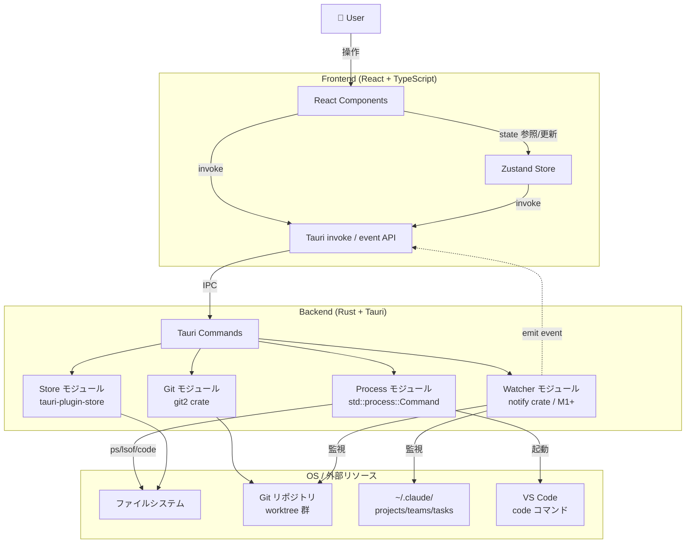
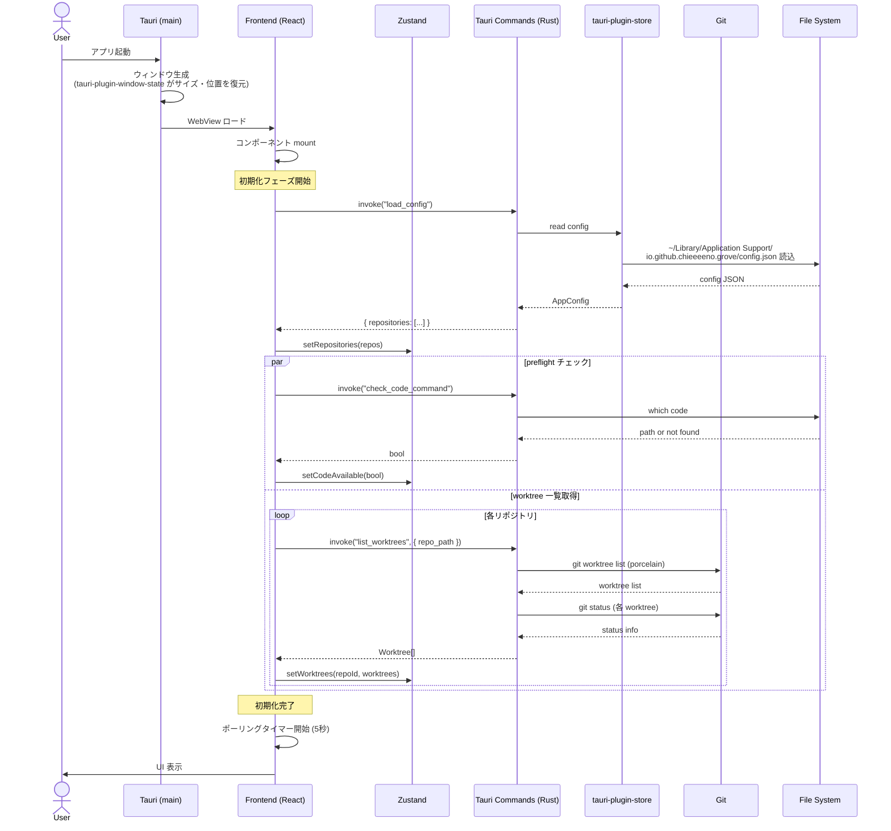
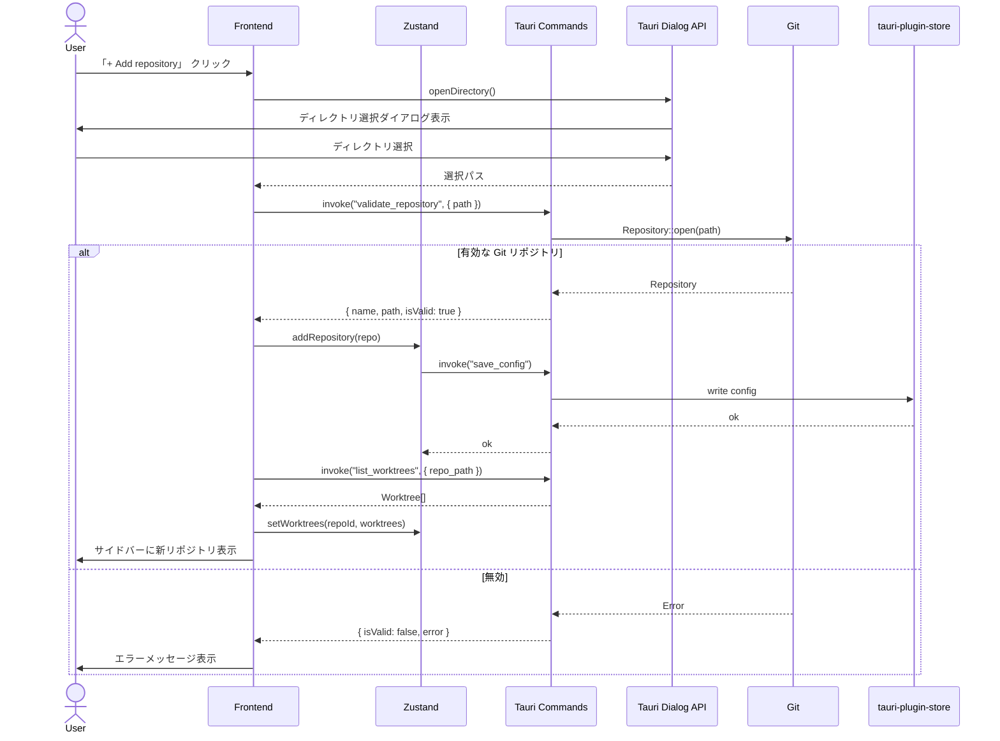
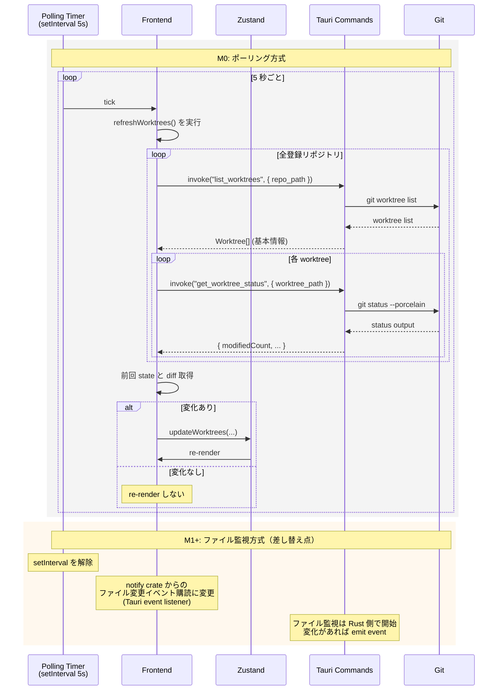
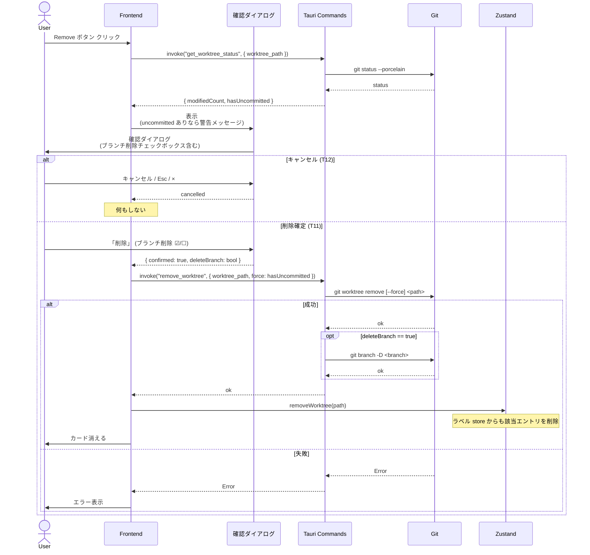
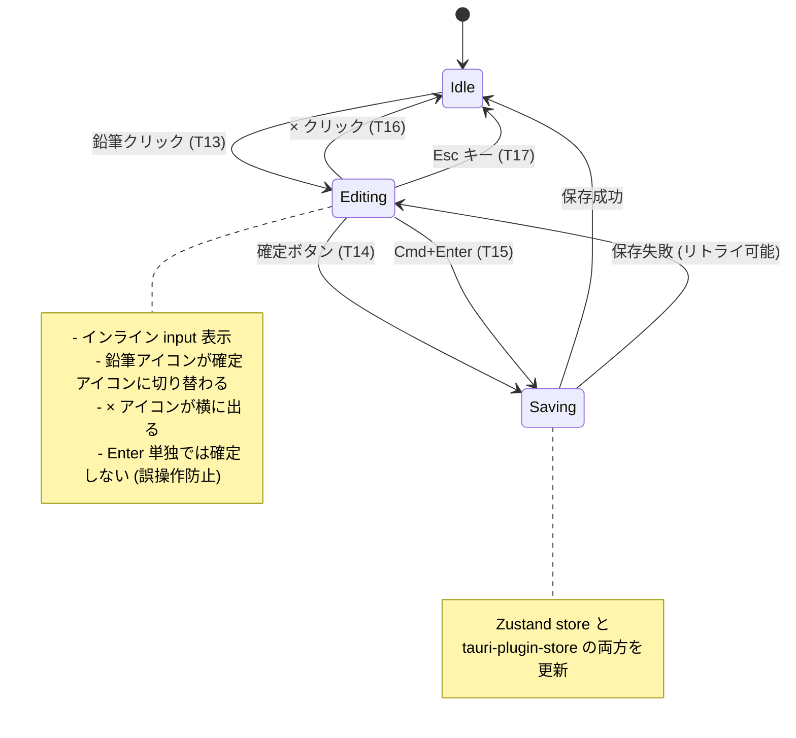
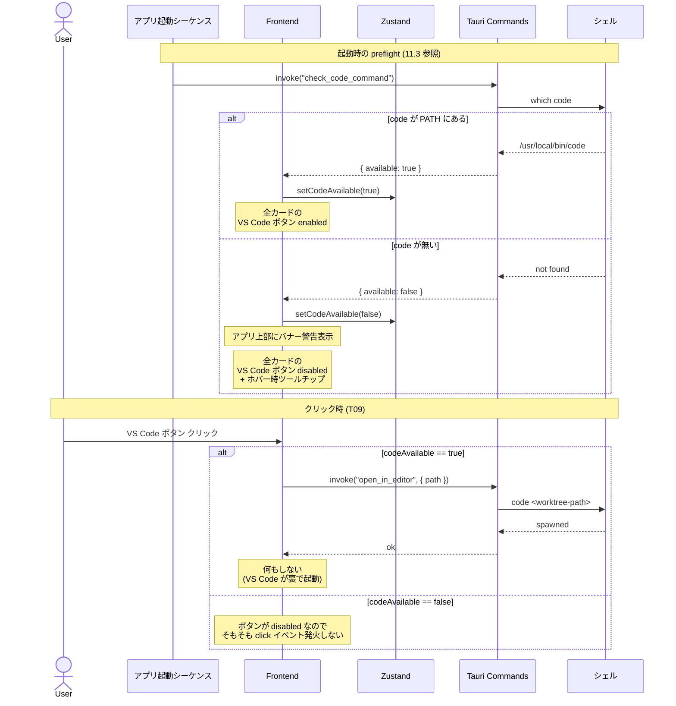
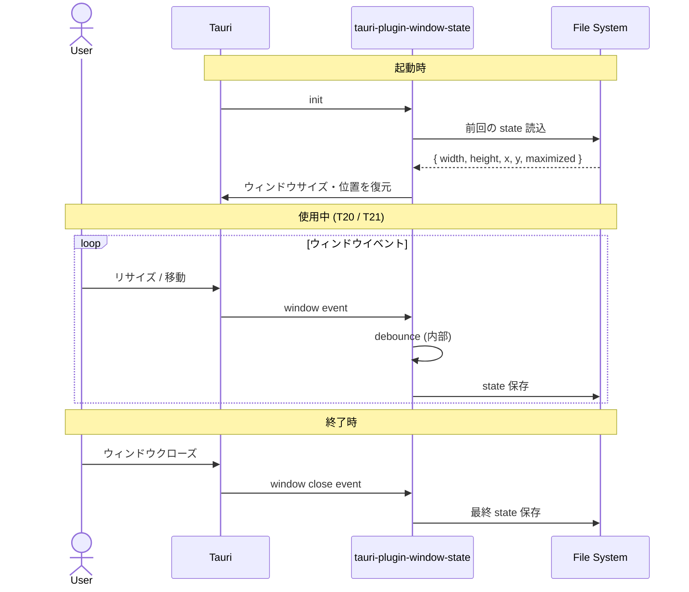
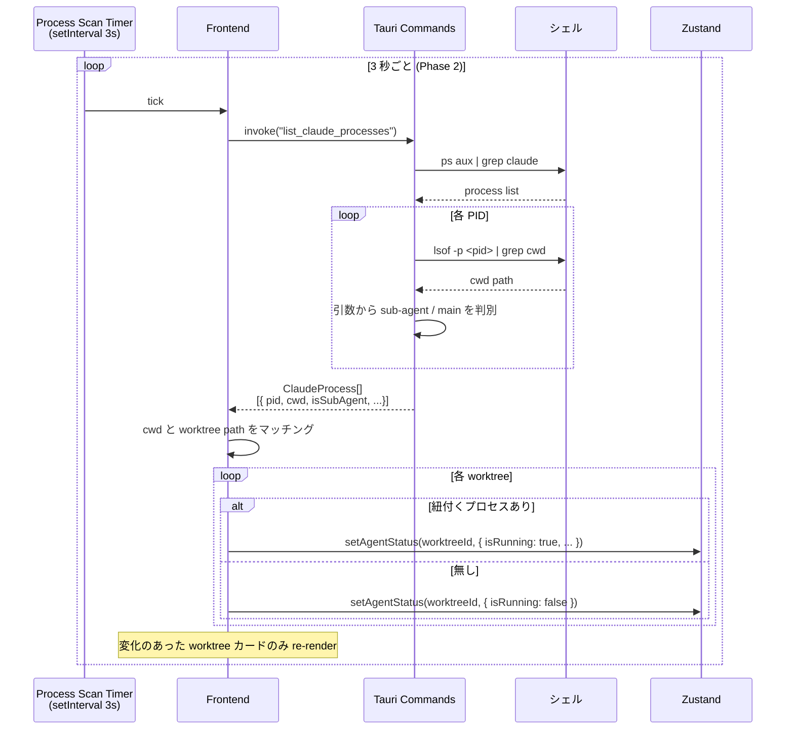
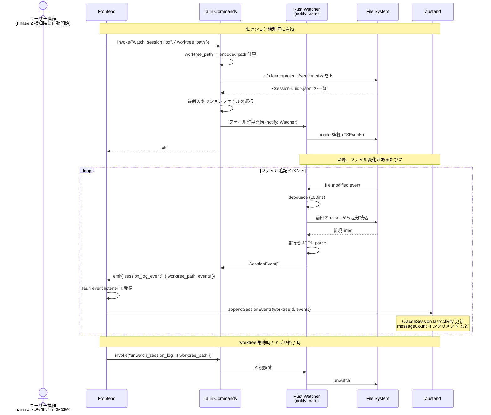

# Grove — 設計書

> Git Worktree Manager GUI アプリケーション
> Version: 0.2.0 (Draft)
> 最終更新: 2026-04-07

> **このドキュメントの位置付け**
>
> 本設計書は Grove の「全体像と技術的な構造」を記述する。
> 個別の意思決定の根拠は [docs/adr/](./docs/adr/)、マイルストーン定義とスコープは [ROADMAP.md](./ROADMAP.md) を参照。
> 各種決定の理由・検討した選択肢・却下した代替案は ADR が一次情報。設計書と ADR で齟齬がある場合は **ADR を優先** する。

---

## 1. プロジェクト概要

### 1.1 背景・課題

Git worktree を活用した並列開発（特に Claude Code との併用）が一般化する中で、worktree の管理は依然として CLI ベースの操作に依存している。複数のリポジトリ × 複数の worktree を扱う開発者にとって、以下の課題がある。

- worktree の一覧性が低く、全体の状況が把握しにくい
- 各 worktree の作業状態（変更ファイル数、ahead/behind）を確認するために複数コマンドの実行が必要
- Claude Code エージェントが各 worktree でどのような作業をしているか可視化する手段がない
- VS Code で対象の worktree を開くまでに手間がかかる

### 1.2 プロダクトビジョン

Grove は、Git worktree をGUIで直感的に管理するデスクトップアプリケーションである。リポジトリ単位での worktree の一覧表示・作成・削除に加え、Claude Code エージェントの稼働状況をリアルタイムに可視化し、開発者の並列開発ワークフローを支援する。

### 1.3 ターゲットユーザー

- Git worktree を日常的に使用するフロントエンド/フルスタックエンジニア
- Claude Code を使って並列開発を行う開発者
- CUI よりも GUI での操作を好む開発者

---

## 2. 技術スタック

| レイヤー | 技術 | 備考 |
|---|---|---|
| フレームワーク | Tauri 2 | 軽量デスクトップアプリ（~5-10MB） |
| フロントエンド | React 19 + TypeScript | SPA構成 |
| スタイリング | Tailwind CSS v4 | ユーティリティファースト |
| 状態管理 | Zustand | 軽量で React との親和性が高い |
| バックエンド（Native） | Rust（Tauri commands） | Tauri の IPC 経由で呼び出し |
| Git 操作 | git2 crate（libgit2） | Rust ネイティブの Git ライブラリ |
| プロセス実行 | std::process::Command | VS Code 起動、Claude Code 連携 |
| データ永続化 | tauri-plugin-store | JSON ベースのローカルストレージ |

### 2.1 技術選定理由

**Tauri を選択した理由（vs Electron）：**

- バンドルサイズが小さい（~10MB vs ~150MB）
- メモリ消費が少ない（Claude Code と併用するため重要）
- 起動が高速（0.5秒以下）
- git2 crate による高速な Git 操作が可能
- セキュリティがデフォルトで堅牢

**考慮したトレードオフ：**

- Rust の学習コストが発生するが、Claude Code の支援により軽減可能
- Tauri のエコシステムは Electron より小さいが、本アプリに必要な機能は十分カバーされている

---

## 3. アプリケーション構成

### 3.1 画面レイアウト

3カラム構成を採用する。

```
┌──────────┬────────────────────────┬──────────────┐
│          │                        │              │
│ Sidebar  │     Main Area          │  Detail      │
│          │                        │  Panel       │
│ (リポジ  │  (Worktree カード一覧)  │ (選択した    │
│  トリ    │                        │  worktreeの  │
│  一覧)   │                        │  詳細情報)   │
│          │                        │              │
└──────────┴────────────────────────┴──────────────┘
  200px        flexible                 280px
              (カード2列 grid)       (カード選択時に表示)
```

### 3.2 左サイドバー（Sidebar）

- アプリロゴ・タイトル表示
- 登録済みリポジトリの一覧表示
  - リポジトリ名
  - worktree 数
  - アクティブなエージェント数（バッジ表示）
- 選択中リポジトリのハイライト
- 「+ Add repository」ボタン

### 3.3 メインエリア（Main Area）

- 選択中リポジトリの名前・パス表示
- 「+ Add worktree」ボタン
- Worktree カードの Grid 表示（2列、レスポンシブ）

#### Worktree カードに表示する情報

| 項目 | 説明 | M0 |
|---|---|---|
| ラベル（編集可能） | デフォルトは worktree のディレクトリ名。ユーザーが上書き可能。詳細は ADR-0008 | ✅ |
| ブランチ名 | ラベルの副次情報として小さく表示 | ✅ |
| ステータスバッジ | primary / Claude Code / idle | Phase 2 |
| 最終コミット | 相対時間 + コミットメッセージ | ✅ |
| 変更ファイル数 | 合計値のみ。種別（modified/added/deleted）には分けない（ADR-0011） | ✅ |
| ahead/behind | リモートとの差分 | ❌ M1+（ADR-0010） |
| アクションボタン | VS Code / Remove（M0）<br>Terminal / Diff は M1 以降 | 一部 |

ラベル編集の操作仕様（ADR-0008）:
- 鉛筆アイコンクリック → インライン編集モード
- 確定ボタン or Cmd+Enter で確定
- Esc キー or × アイコンでキャンセル
- Enter 単独では確定しない（誤操作防止）

#### カードの状態による表示分け

| 状態 | ボーダー | バッジ | 備考 |
|---|---|---|---|
| primary (main) | 通常 | 緑「primary」 | 削除不可 |
| Claude Code 稼働中 | 青ボーダー（強調） | 青「Claude Code」 | 作業内容サマリ表示 |
| idle | 通常 | グレー「idle」 | Remove ボタン表示 |

### 3.4 詳細パネル（Detail Panel）

カードをクリックすると右側に表示される。

- **ヘッダー**: ブランチ名、worktree パス
- **Agent team セクション**:
  - Lead agent / Sub-agent の一覧
  - 各エージェントの稼働ステータス（稼働中 / 待機中）
  - 各エージェントが実行中のタスク概要
- **Changed files セクション**:
  - 変更ファイル一覧（M: modified, A: added, D: deleted）
- **Recent activity セクション**:
  - 直近のコミット履歴
  - どのエージェントがコミットしたか表示

---

## 4. 機能仕様

### 4.1 リポジトリ管理

| 機能 | 説明 |
|---|---|
| リポジトリ追加 | ローカルの Git リポジトリをディレクトリ選択で登録 |
| リポジトリ削除 | サイドバーから登録解除（実ファイルは削除しない） |
| リポジトリ切り替え | サイドバーでクリックして選択 |
| 永続化 | 登録済みリポジトリのパス一覧を tauri-plugin-store で保存 |

### 4.2 Worktree 管理

| 機能 | 説明 |
|---|---|
| 一覧表示 | `git worktree list` 相当の情報をカードで表示 |
| 新規作成 | ブランチ名を指定して worktree を作成。既存ブランチ / 新規ブランチ対応 |
| 削除 | worktree を削除。未コミットの変更がある場合は確認ダイアログを表示 |
| 自動リフレッシュ | 一定間隔（例: 5秒）で Git の状態を再取得 |

### 4.3 エディタ連携

| 機能 | 説明 |
|---|---|
| VS Code で開く | `code <worktree-path>` を実行して VS Code を起動 |
| 将来拡張 | Cursor 等の他エディタ対応（Phase 3） |

### 4.4 Claude Code エージェント連携（Phase 2）

スパイク調査（ROADMAP.md「検証ログ」セクション参照）により、以下のデータソースに依存する実装方針が確立した。公式ドキュメント裏付けあり。

#### データソース

| 種類 | 場所 | 用途 |
|---|---|---|
| プロセス情報 | `ps aux \| grep claude` + `lsof` | 稼働中の claude プロセスを列挙、cwd で worktree と紐付け |
| プロジェクト別セッション | `~/.claude/projects/<encoded-path>/` | パスの `/` を `-` に置換した名前のディレクトリ |
| セッションログ | `<encoded-path>/<session-uuid>.jsonl` | リアルタイム追記される JSONL。`cwd`, `parentUuid`, `sessionId`, `timestamp` 等を含む |
| セッションメタデータ | `<encoded-path>/sessions-index.json` | git branch, message count, auto summary, timestamps |
| Agent Team 設定 | `~/.claude/teams/{team-name}/config.json` | `members` 配列に teammate 名・agent ID・agent type |
| Agent Team タスク | `~/.claude/tasks/{team-name}/` | 共有タスクリストの状態 |
| グローバル履歴 | `~/.claude/history.jsonl` | プロンプト・タイムスタンプ・プロジェクトパス・セッションID |

#### 機能一覧

| 機能 | 説明 | 実装方針 |
|---|---|---|
| 稼働検知 | 各 worktree で Claude Code プロセスが動いているか | プロセス cwd と worktree path のマッチング |
| メタデータ表示 | セッション数・最終アクセス時刻・サマリー等 | `sessions-index.json` から取得 |
| リアルタイム状態 | 直近のメッセージや tool 使用状況 | 最新 `<session-uuid>.jsonl` を tail（`notify` crate） |
| エージェントチーム可視化 | Lead / Teammate の一覧と各タスクの進捗 | `~/.claude/teams/*/config.json` + `~/.claude/tasks/*/` |
| Subagent 検知 | サブエージェントの稼働 | 親プロセスの引数（`--output-format stream-json`）から判定 |
| コミット帰属 | どのエージェントがどのコミットを行ったか | 自動判定は困難。コミットメッセージ規約での運用を推奨 |

#### 注意点

- **Agent Teams は実験的機能**: `CLAUDE_CODE_EXPERIMENTAL_AGENT_TEAMS=1` で有効化される。API が将来変わる可能性があるため、Grove 側で抽象化レイヤーを設けて変更に追従できるようにする
- **JSONL の正式スキーマは未公開**: third-party 記事ベースで実装しつつ、実機で逆算する
- **2 種類の worktree に対応**: ユーザー独自スキルで作成された worktree と、`claude --worktree` で作成された worktree（`<repo>/.claude/worktrees/<name>`）の両方を検出する

---

## 5. データモデル

### 5.1 永続化データ（tauri-plugin-store）

```typescript
// アプリ設定
interface AppConfig {
  repositories: RepositoryConfig[];
  editor: "vscode";  // 将来: "cursor" | "other"
  theme: "system";   // 将来: "light" | "dark"
  refreshInterval: number; // ms (default: 5000)
}

// リポジトリ設定
interface RepositoryConfig {
  id: string;        // UUID
  name: string;      // 表示名
  path: string;      // 絶対パス
  addedAt: string;   // ISO 8601
}
```

### 5.2 ランタイムデータ（Zustand store）

```typescript
// Worktree 情報
interface Worktree {
  path: string;
  branch: string;
  isMain: boolean;
  head: string;           // commit hash
  lastCommitMessage: string;
  lastCommitTime: string;  // ISO 8601
  modifiedCount: number;
  ahead: number;
  behind: number;
  agentStatus: AgentStatus | null;
}

// エージェント状態（Phase 2）
interface AgentStatus {
  isRunning: boolean;
  // 単一セッション (subagent も含む)
  session?: ClaudeSession;
  // Agent Team が存在する場合
  team?: AgentTeam;
}

interface ClaudeSession {
  sessionId: string;        // UUID
  pid?: number;             // 稼働中なら PID
  cwd: string;              // 各メッセージの cwd フィールドから取得
  lastActivity: string;     // ISO 8601
  messageCount: number;     // sessions-index.json から取得
  gitBranch: string;        // sessions-index.json から取得
  autoSummary: string;      // sessions-index.json から取得
}

interface AgentTeam {
  teamName: string;
  configPath: string;       // ~/.claude/teams/<team-name>/config.json
  members: AgentTeamMember[];
  tasks: AgentTeamTask[];
}

interface AgentTeamMember {
  name: string;
  agentId: string;
  agentType: string;
  isLead: boolean;
}

interface AgentTeamTask {
  id: string;
  description: string;
  status: "pending" | "in_progress" | "completed";
  assignee?: string;        // teammate 名
}
```

> **注**: Agent Teams は実験的機能 (`CLAUDE_CODE_EXPERIMENTAL_AGENT_TEAMS=1` で有効化) のため、上記スキーマは公式仕様ではなく実装時に逆算する必要がある。スキーマ変更に追従しやすいよう、Rust 側でデータ取得層を抽象化して切り替え可能にする。

---

## 6. Tauri コマンド設計（Rust）

### 6.1 Phase 1 で実装するコマンド

```rust
// リポジトリ検証
#[tauri::command]
fn validate_repository(path: String) -> Result<RepositoryInfo, String>

// Worktree 一覧取得
#[tauri::command]
fn list_worktrees(repo_path: String) -> Result<Vec<WorktreeInfo>, String>

// Worktree 作成
#[tauri::command]
fn create_worktree(
    repo_path: String,
    branch_name: String,
    create_new_branch: bool,
    base_branch: Option<String>,
) -> Result<WorktreeInfo, String>

// Worktree 削除
#[tauri::command]
fn remove_worktree(
    repo_path: String,
    worktree_path: String,
    force: bool,
) -> Result<(), String>

// Git ステータス取得
#[tauri::command]
fn get_worktree_status(worktree_path: String) -> Result<WorktreeStatus, String>

// VS Code で開く
#[tauri::command]
fn open_in_editor(path: String) -> Result<(), String>
```

### 6.2 Phase 2 で追加するコマンド

```rust
// 稼働中の claude プロセスを列挙
#[tauri::command]
fn list_claude_processes() -> Result<Vec<ClaudeProcess>, String>

// worktree path から ~/.claude/projects 配下のセッションメタデータを取得
#[tauri::command]
fn get_session_metadata(worktree_path: String) -> Result<SessionMetadata, String>

// 最新セッションログ (JSONL) の tail を開始 (notify crate でファイル監視)
#[tauri::command]
fn watch_session_log(worktree_path: String) -> Result<(), String>

// Agent Team の設定とタスクを取得
#[tauri::command]
fn list_agent_teams() -> Result<Vec<AgentTeam>, String>

// Agent Team config.json を解析
#[tauri::command]
fn read_agent_team(team_name: String) -> Result<AgentTeam, String>
```

#### 6.3 worktree path → projects ディレクトリの変換

`~/.claude/projects/` の命名規約は「絶対パスの `/` を `-` に置換」。Grove はこの変換ロジックを Rust ヘルパーとして実装する:

```rust
fn worktree_path_to_projects_dir(worktree_path: &str) -> PathBuf {
    let encoded = worktree_path.replace('/', "-");
    dirs::home_dir().unwrap().join(".claude/projects").join(encoded)
}
```

---

## 7. フロントエンド コンポーネント設計

### 7.1 コンポーネントツリー

```
App
├── Sidebar
│   ├── AppLogo
│   ├── RepositoryList
│   │   └── RepositoryItem
│   └── AddRepositoryButton
├── MainArea
│   ├── MainHeader
│   │   ├── RepositoryTitle
│   │   └── AddWorktreeButton
│   └── WorktreeGrid
│       └── WorktreeCard
│           ├── CardHeader (ブランチ名 + ステータスバッジ)
│           ├── CardBody (コミット情報 + 変更数)
│           ├── AgentSummary (Phase 2, Claude Code稼働時のみ)
│           └── CardActions (VS Code / Terminal / Diff / Remove)
└── DetailPanel (カード選択時に表示)
    ├── PanelHeader
    ├── AgentTeamSection (Phase 2)
    ├── ChangedFilesSection
    └── RecentActivitySection
```

### 7.2 Zustand Store 構成

```typescript
interface AppStore {
  // リポジトリ
  repositories: RepositoryConfig[];
  selectedRepositoryId: string | null;
  addRepository: (path: string) => Promise<void>;
  removeRepository: (id: string) => void;
  selectRepository: (id: string) => void;

  // Worktree
  worktrees: Worktree[];
  selectedWorktreeIndex: number | null;
  selectWorktree: (index: number | null) => void;
  refreshWorktrees: () => Promise<void>;
  createWorktree: (branchName: string, createNew: boolean) => Promise<void>;
  removeWorktree: (path: string, force: boolean) => Promise<void>;

  // UI
  isDetailPanelOpen: boolean;
}
```

---

## 8. 開発フェーズ

> **マイルストーン定義は [ROADMAP.md](./ROADMAP.md) を参照**
>
> 本セクションは技術的な「Phase」（実装の論理的な塊）を示す。「いつまでに何をやるか」のマイルストーン（M0/M1/M2）は ROADMAP.md で管理する。
>
> 対応関係:
> - Phase 1（基本機能）→ M0 + M1 で段階的に実装
> - Phase 2（Claude Code 連携）→ M0 完成後、M1 / M2 にまたがって実装
> - Phase 3（Polish）→ M2 で実装

### Phase 1 — MVP（基本機能）

リポジトリ管理と worktree の基本的な操作を実装する。

- [ ] Tauri 2 + React 19 + TypeScript + Tailwind v4 プロジェクトのセットアップ
- [ ] 左サイドバー（リポジトリ一覧、複数リポジトリ対応）
- [ ] メインエリア（worktree カード Grid 表示）
- [ ] worktree カードのラベル機能（ADR-0008）
- [ ] worktree の削除（確認ダイアログ付き、ブランチ削除オプション含む）
- [ ] worktree の新規作成ダイアログ（M1 で実装、ADR-0008 関連）
- [ ] worktree の rename 機能（M1 で実装、ADR-0008）
- [ ] Git status 情報の表示（変更数のみ、ADR-0011）
- [ ] ahead/behind 表示（M1 以降、ADR-0010）
- [ ] VS Code で開くボタン + preflight チェック（ADR-0012）
- [ ] リポジトリ登録の永続化（tauri-plugin-store、ADR-0005）
- [ ] ウィンドウサイズ・位置の永続化（tauri-plugin-window-state）
- [ ] 自動リフレッシュ（ポーリング → ファイル監視に進化、ADR-0013）
- [ ] 手動リフレッシュボタン + Cmd+R ショートカット
- [ ] UI は日本語のみ（ADR-0009）
- [ ] エラーハンドリングは preflight 原則に従う（ADR-0012）

### Phase 2 — Agent（Claude Code 連携）

Claude Code エージェントの状況をリアルタイムに可視化する。
スパイク調査により公式ドキュメント裏付けを得て、設計書当初の野心通りに実装可能と判明（ROADMAP.md「検証ログ」参照）。

- [ ] Claude Code プロセスの稼働検知（`ps` + `lsof`）
- [ ] worktree path → `~/.claude/projects/` の変換ロジック
- [ ] `sessions-index.json` からのメタデータ取得
- [ ] 最新 JSONL の tail 監視（`notify` crate）
- [ ] 詳細パネル（右カラム）の実装
- [ ] Agent Teams 検知（`~/.claude/teams/*/config.json`）
- [ ] Lead / Teammate の一覧と各タスクの進捗表示
- [ ] Subagent 検知（親プロセスの引数解析）
- [ ] コミット履歴の表示
- [ ] コミット帰属の手動運用ガイド（自動判定は困難なため）

### Phase 3 — Polish（拡張・改善）

ユーザー体験の向上と機能拡張を行う。M2 段階で実装する。

- [ ] エディタ選択機能（VS Code / Cursor / その他）
- [ ] ターミナル起動ボタン
- [ ] Diff 表示機能
- [ ] 通知機能（エージェント完了時など）
- [ ] テーマ対応（ライト / ダーク / システム連動）
- [ ] 設定画面
- [ ] キーボードショートカットの拡充
- [ ] i18n / 英語対応（ADR-0009）
- [ ] テレメトリ（opt-in、ADR-0006）
- [ ] 自動更新機能
- [ ] Homebrew tap での配布（ADR-0007）
- [ ] コード署名（M2 で再判断、ADR-0007）

---

## 9. ディレクトリ構成（想定）

```
grove/
├── src/                      # Frontend (React)
│   ├── components/
│   │   ├── sidebar/
│   │   │   ├── Sidebar.tsx
│   │   │   ├── RepositoryList.tsx
│   │   │   └── RepositoryItem.tsx
│   │   ├── main/
│   │   │   ├── MainArea.tsx
│   │   │   ├── MainHeader.tsx
│   │   │   ├── WorktreeGrid.tsx
│   │   │   └── WorktreeCard.tsx
│   │   ├── detail/
│   │   │   ├── DetailPanel.tsx
│   │   │   ├── AgentTeamSection.tsx
│   │   │   ├── ChangedFilesSection.tsx
│   │   │   └── RecentActivitySection.tsx
│   │   └── shared/
│   │       ├── Badge.tsx
│   │       ├── Button.tsx
│   │       └── Dialog.tsx
│   ├── stores/
│   │   └── appStore.ts
│   ├── hooks/
│   │   ├── useWorktrees.ts
│   │   └── useAutoRefresh.ts
│   ├── lib/
│   │   └── tauri.ts          # Tauri invoke wrappers
│   ├── types/
│   │   └── index.ts
│   ├── App.tsx
│   ├── main.tsx
│   └── index.css
├── src-tauri/                 # Backend (Rust)
│   ├── src/
│   │   ├── main.rs
│   │   ├── commands/
│   │   │   ├── mod.rs
│   │   │   ├── repository.rs
│   │   │   ├── worktree.rs
│   │   │   └── editor.rs
│   │   └── git/
│   │       ├── mod.rs
│   │       ├── worktree.rs
│   │       └── status.rs
│   ├── Cargo.toml
│   └── tauri.conf.json
├── package.json
├── tsconfig.json
├── tailwind.config.ts
├── CLAUDE.md                  # Claude Code 用プロジェクト仕様
└── README.md
```

---

## 10. 既存ツールとの差別化

| 項目 | Grove | Worktrunk | wtp | LazyWorktree |
|---|---|---|---|---|
| インターフェース | GUI（デスクトップ） | CLI | CLI | TUI |
| リポジトリ管理 | 複数リポジトリ対応 | 単一 | 単一 | 単一 |
| Worktree 可視化 | カード表示 | テキスト一覧 | テキスト一覧 | テキスト一覧 |
| Claude Code 連携 | エージェント状態表示 | なし | なし | なし |
| エディタ連携 | ワンクリック起動 | なし | なし | なし |
| 対象ユーザー | GUI 好みの開発者 | CLI ユーザー | CLI ユーザー | TUI ユーザー |

---

## 11. 処理フロー・シーケンス図

実装時に「ここの分岐どうするんやっけ」「リフレッシュのトリガーどこから来るんやっけ」を防ぐため、主要な処理フローを図示する。Mermaid 形式で記述（GitHub で自動レンダリングされる）。

---

### 11.1 トリガー一覧

Grove で発生する全てのトリガー（イベント・タイマー・ライフサイクル）の一覧。実装時はこれを潰し漏れなく対応する。

| # | トリガー | 種別 | 発生条件 | 起動する処理 | フェーズ |
|---|---|---|---|---|---|
| T01 | アプリ起動 | ライフサイクル | ユーザーが Grove を起動 | 設定読込 → preflight チェック → worktree 一覧取得 → ポーリング開始 | M0 |
| T02 | アプリ終了 | ライフサイクル | ウィンドウクローズ | ポーリング停止 → ファイル監視解除 → store flush | M0 |
| T03 | ポーリングタイマー | タイマー | 5 秒間隔（ADR-0013） | 全リポジトリの worktree 一覧 + git status を再取得 | M0 |
| T04 | プロセススキャンタイマー | タイマー | 3 秒間隔（仮、Phase 2） | `ps aux | grep claude` で claude プロセス列挙 → cwd 取得 → worktree マッチング | Phase 2 |
| T05 | JSONL ファイル変更 | ファイル監視 | `~/.claude/projects/<encoded>/<uuid>.jsonl` への追記 | 新規行を tail → JSONL parse → ClaudeSession 更新 | Phase 2 |
| T06 | リポジトリ追加ボタン クリック | ユーザー | サイドバーの「+ Add repository」 | ディレクトリ選択ダイアログ → validate → store 保存 → worktree 一覧取得 | M0 |
| T07 | リポジトリ選択 | ユーザー | サイドバー上のリポジトリ項目クリック | 選択中リポジトリ ID 更新 → メインエリアに対応 worktree カードを表示 | M0 |
| T08 | worktree カード選択 | ユーザー | カードクリック | 詳細パネル表示（M1 以降） | M1+ |
| T09 | VS Code ボタン クリック | ユーザー | カード上の VS Code アイコン | preflight 通過済みなら `open_in_editor(path)` を実行 | M0 |
| T10 | Remove ボタン クリック | ユーザー | カード上の Remove アイコン | 確認ダイアログ表示 → 削除実行 | M0 |
| T11 | 削除ダイアログ 確定 | ユーザー | ダイアログ内「削除」ボタン | `remove_worktree` 実行（force / branch 削除フラグ含む） | M0 |
| T12 | 削除ダイアログ キャンセル | ユーザー | ダイアログ内「キャンセル」/ Esc / × | ダイアログ閉じる、何もしない | M0 |
| T13 | ラベル鉛筆 クリック | ユーザー | カードの鉛筆アイコン | 編集モードに遷移（インライン input 表示） | M0 |
| T14 | ラベル確定 ボタン | ユーザー | 編集モード中の確定アイコン | 新しいラベルを store に保存 → 表示モードに戻る | M0 |
| T15 | ラベル確定 Cmd+Enter | キーボード | 編集モード中の Cmd+Enter | T14 と同じ | M0 |
| T16 | ラベルキャンセル × | ユーザー | 編集モード中の × アイコン | 編集破棄、表示モードに戻る | M0 |
| T17 | ラベルキャンセル Esc | キーボード | 編集モード中の Esc キー | T16 と同じ | M0 |
| T18 | 手動リフレッシュ ボタン | ユーザー | 上部の更新アイコン | T03 と同じ処理を即座に実行（タイマーをリセットしない） | M0 |
| T19 | 手動リフレッシュ Cmd+R | キーボード | グローバルショートカット | T18 と同じ | M0 |
| T20 | ウィンドウリサイズ | ウィンドウ | ユーザーがリサイズ | tauri-plugin-window-state が自動でサイズ・位置を保存 | M0 |
| T21 | ウィンドウ移動 | ウィンドウ | ユーザーがウィンドウ移動 | T20 と同じ | M0 |

> **メモ**: T05 のファイル監視は M0 ではポーリング（T03）に統合される。M1 早期で notify crate に切り替える際に独立したトリガーとして実装する（ADR-0013）。

---

### 11.2 全体アーキテクチャ図

レイヤー構成と責務分担。



---

### 11.3 アプリ起動シーケンス（T01）



---

### 11.4 リポジトリ追加フロー（T06）



---

### 11.5 worktree 一覧 + 自動リフレッシュ（T03 / T18 / T19）

ポーリング方式（M0）。M1 でファイル監視に差し替える際の入れ替え点を明示。



**手動リフレッシュ（T18 / T19）**: ボタンクリック または Cmd+R で `refreshWorktrees()` を即時実行。タイマーはリセットせず、次の自動 tick はそのまま走る。

---

### 11.6 worktree 削除シーケンス（T10 / T11）

force と branch 削除の分岐を明示。



---

### 11.7 ラベル編集の状態遷移（T13〜T17）

ADR-0008 のラベル機能。状態遷移図で誤操作・整合性ロジックを潰す。



---

### 11.8 VS Code 起動 + preflight チェック（T09）

ADR-0012 の preflight 原則に従う。起動時のチェックとボタンクリック時のフローを分けて図示。



---

### 11.9 ウィンドウサイズ・位置の永続化（T20 / T21）

実装は tauri-plugin-window-state にほぼ任せる。設計上の挙動だけ明示。



---

### 11.10 Phase 2: claude プロセス検知（T04）



> **メモ**: ポーリング間隔（3 秒）は実装時に調整する。プロセススキャンは worktree リフレッシュ（5 秒）と独立したタイマーにする方が、責務分離と頻度調整の自由度が上がる。

---

### 11.11 Phase 2: セッションログ監視（T05）

JSONL の tail を notify crate で実装。Tauri event を経由して Frontend に通知。



> **メモ**:
> - 同一 worktree で複数セッションが並行することがある（`claude --resume` 等）。実装時は最新セッションだけでなく「直近 N 件のアクティブセッション」を監視する設計を検討する
> - リソースリーク防止のため、worktree 削除時には必ず `unwatch_session_log` を呼ぶ
> - notify crate の挙動は OS 依存。macOS の FSEvents は深いディレクトリで重くなることがあるため、監視対象は `<session-uuid>.jsonl` ファイル単位に絞る（プロジェクトディレクトリ全体は監視しない）

---

## 付録

### A. 参考リンク

- [Tauri 2 公式ドキュメント](https://v2.tauri.app/)
- [git2 crate](https://crates.io/crates/git2)
- [tauri-plugin-store](https://github.com/tauri-apps/plugins-workspace/tree/v2/plugins/store)
- [Claude Code CLI](https://docs.anthropic.com/en/docs/claude-code)

### B. UI モックアップ

本設計書の作成過程で、以下のモックアップを作成・検討した。

1. **v1**: セレクトボックスによるリポジトリ選択 + worktree カード一覧
2. **v2**: 左サイドバーによるリポジトリ選択 + worktree カード一覧
3. **v3**: 3カラム構成（サイドバー + カード一覧 + 詳細パネル + エージェントチーム表示）

最終的に v3 の3カラム構成を採用した。
